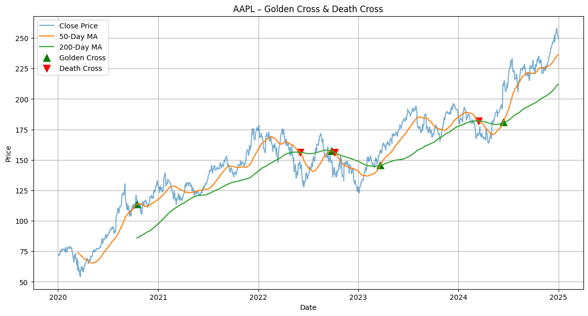

# Golden Cross Detection with Python

This project is a **simple Python notebook** that detects and visualizes the **Golden Cross** and **Death Cross** using **50-day and 200-day moving averages** on stock price data.

It is built to run easily in **Google Colab** and uses publicly available market data.

---

## What is a Golden Cross?

A **Golden Cross** occurs when:
- The **50-day moving average** crosses **above**
- The **200-day moving average**

This is commonly interpreted as a **bullish trend signal**, suggesting that price momentum is turning positive.

The opposite signal is the **Death Cross**, where the 50-day MA crosses below the 200-day MA, often considered bearish.

---

## What does this code do?

This notebook:
1. Downloads historical stock price data using `yfinance`
2. Calculates **50-day and 200-day moving averages**
3. Detects **Golden Cross** and **Death Cross** events
4. **Pinpoints exact dates and prices** where crossovers occur
5. Visualizes:
   - Closing price
   - Moving averages
   - Golden Cross
   - Death Cross
---

## Visualization Example

Below is an example of the output visualization:

---
